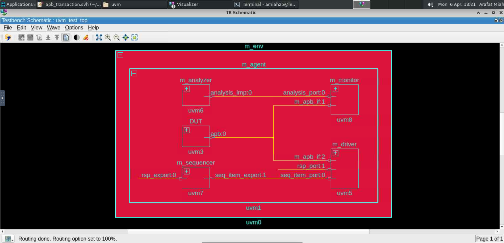
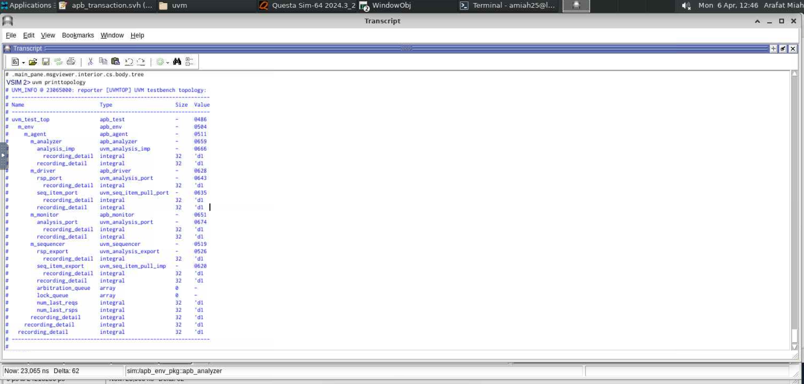
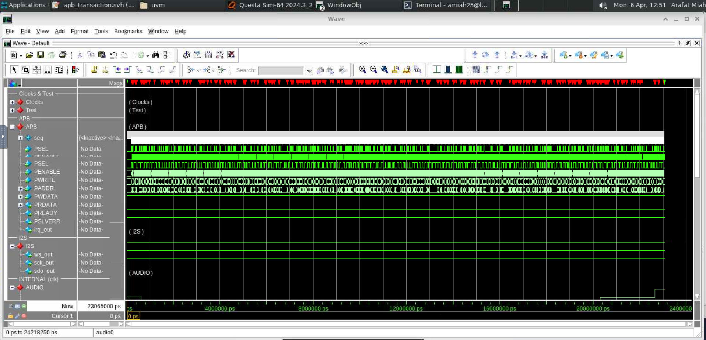
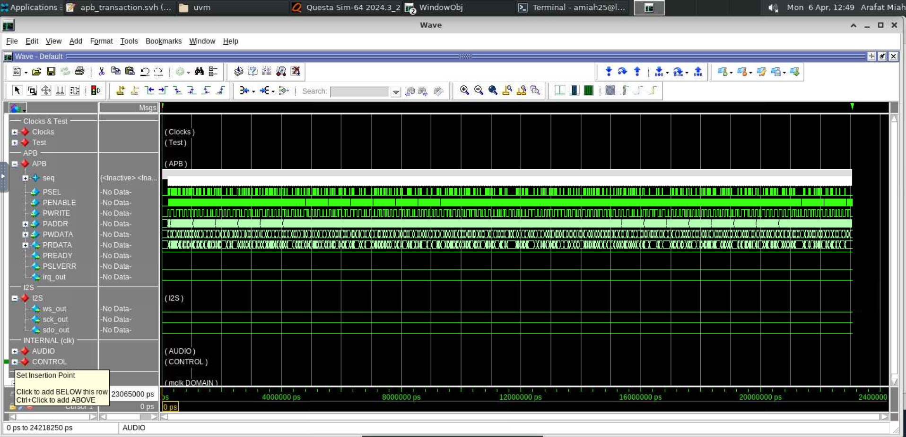
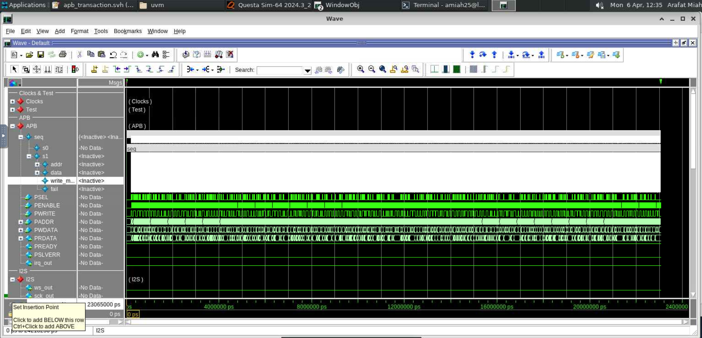

# Universal Verification Methodology (UVM) - APB Bus Verification

## Overview
This repository documents my transition from hardware design (RTL) into software-oriented functional verification using the **Universal Verification Methodology (UVM)**. The objective of this lab was to verify the APB (Advanced Peripheral Bus) interface of an Audio DSP chip using Object-Oriented SystemVerilog.

This project required understanding complex UVM architectures, including Transaction-Level Modeling (TLM), dynamic object creation, and Constrained Random Verification. 

*Note: The modified `apb_transaction.svh` file containing the randomization constraints is included in this repository.*

## UVM Testbench Architecture
Unlike traditional Verilog testbenches that manually toggle physical wires, this environment utilizes a highly modular, software-driven factory approach. 

Below is the testbench schematic generated via QuestaSim Visualizer, showing the hierarchical TLM connections between the `apb_sequencer`, `apb_driver`, `apb_monitor`, and `apb_analyzer` (Scoreboard).

*Figure 1: Graphical representation of the UVM testbench and TLM connections.*

*Figure 2: The UVM topology printed from the simulator, confirming the dynamic creation of the environment and agent during the build phase.*

## Constrained Random Verification
The core of UVM testing relies on generating massive amounts of randomized data to stress-test the hardware. However, pure randomness can cause false failures. 

When the simulation was initially run with unconstrained random addresses, the hardware threw multiple assertion errors. This occurred because the randomized addresses were not properly aligned to 4-byte boundaries, and the randomizer was illegally accessing FIFOs and the Command Register simultaneously.

*Figure 3: Initial simulation showing massive assertion failures due to misaligned and illegal address generation.*

To resolve this, I implemented **Constrained Random Verification** within the `apb_transaction.svh` class. By adding the `c_align` and `c_regs` constraints, I forced the randomizer to only generate valid 32-bit aligned addresses and avoid specific command registers.

### Code Snippet (`apb_transaction.svh`)

Once these constraints were applied, the simulation successfully executed hundreds of randomized read/write transactions without a single error, achieving near 100% register coverage.

*Figure 4: Clean RTL simulation after applying proper randomization constraints.*

## Transaction-Level Modeling (TLM) over Waveforms
One of the most powerful visualization tools in this project was mapping the software-level UVM transactions directly over the physical hardware waveforms. 

The image below demonstrates the "bridge" between software and hardware. The `apb_monitor` successfully captured the physical bit-wiggles on the APB bus and translated them back into high-level software packets (blue/purple boxes), which were then broadcasted to the `apb_analyzer` for automatic grading.

*Figure 5: UVM transactions (software objects) overlaid on top of the physical RTL waveforms.*

## Key Learnings
* **Software vs. Hardware Testing:** Successfully bridged the gap between physical RTL execution (time-based) and UVM software execution (object-based).
* **UVM Mechanics:** Mastered the UVM phase mechanisms (build, connect, run) and TLM ports/exports for inter-component communication.
* **Constrained Randomization:** Learned how to restrict SystemVerilog randomizers to generate valid, protocol-compliant test vectors.
* **Debugging Verification IPs:** Learned how to utilize QuestaSim's UVM class browsers and transaction recording tools to isolate bugs within the verification environment itself.

* ## Disclaimer
This repository contains **only a portion of the full laboratory project** and is shared **solely for demonstration and portfolio purposes**.

It is **not intended to be used as a solution reference** for academic coursework or assessments.  
Any reuse should be for learning or professional evaluation only.

---

## Author
**Arafat Miah**  
RTL / Digital Design
   
   // ... (Standard do_copy and do_record methods omitted for brevity)
endclass: apb_transaction
